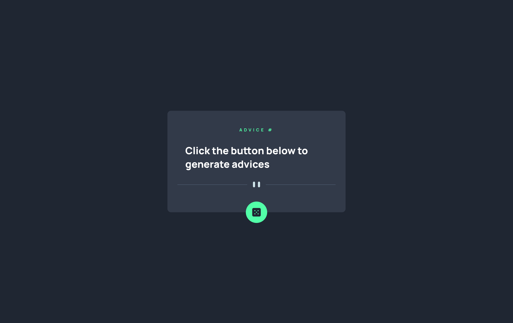

# Frontend Mentor - Advice generator app solution

This is a solution to the [Advice generator app challenge on Frontend Mentor](https://www.frontendmentor.io/challenges/advice-generator-app-QdUG-13db). Frontend Mentor challenges help you improve your coding skills by building realistic projects.

## Table of contents

- [Overview](#overview)
  - [The challenge](#the-challenge)
  - [Screenshot](#screenshot)
  - [Links](#links)
- [My process](#my-process)
  - [Built with](#built-with)
  - [What I learned](#what-i-learned)
  - [Continued development](#continued-development)
  - [Useful resources](#useful-resources)
- [Author](#author)
- [Acknowledgments](#acknowledgments)

## Overview

### The challenge

Users should be able to:

- View the optimal layout for the app depending on their device's screen size
- See hover states for all interactive elements on the page
- Generate a new piece of advice by clicking the dice icon

### Screenshot

### Links

- Solution URL: [solution URL](https://github.com/nickonyi/Advice-generator-app.git)
- Live Site URL: [live site URL](https://advice-generator-app-pi-liart.vercel.app/)

## My process

### Built with

- Semantic HTML5
- SCSS (Sass)
- Flexbox
- Mobile-first workflow
- React (Functional Components & Hooks)
- Advice Slip API

### What I learned

- How to integrate external APIs using fetch in React
- How to position elements (like the dice button) precisely using position: absolute
- How to make SVG components responsive and control their visibility across screen sizes with media queries
- Implementing hover effects using box-shadow to improve UI interactivity

### Continued development

- Improve accessibility (e.g., focus states, ARIA roles)
- Add error handling for failed API requests
- Animate advice transitions for a smoother UX

### Useful resources

- Advice Slip JSON API
- MDN Web Docs - Media Queries
- CSS Tricks - Box Shadow

## Author

- Website - [Add your name here](https://www.your-site.com)
- Frontend Mentor - [@yourusername](https://www.frontendmentor.io/profile/yourusername)
